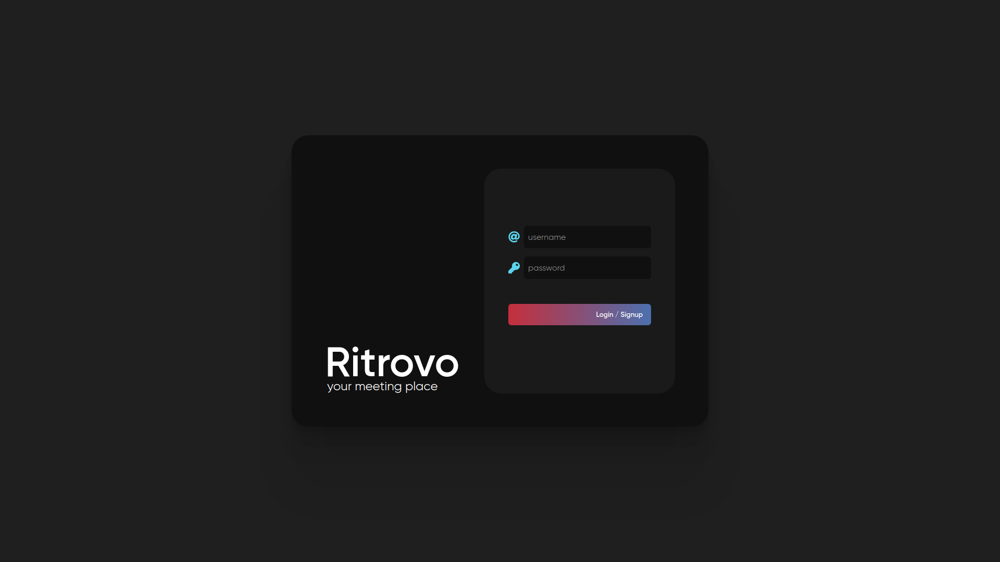
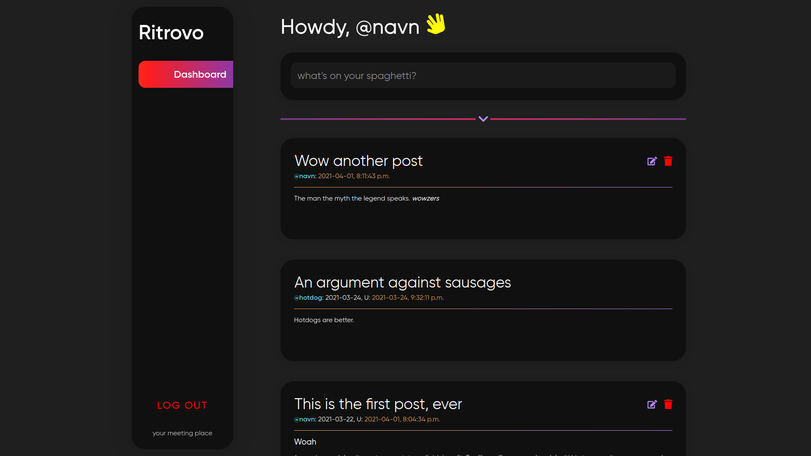
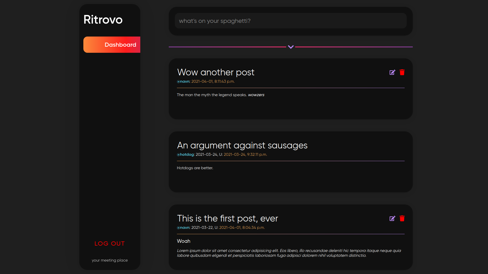
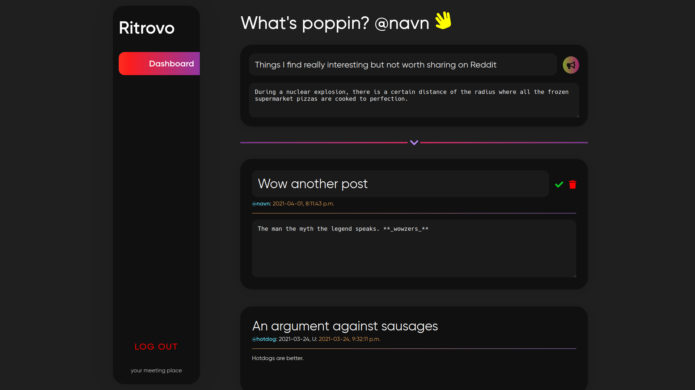

# Ritrovo
> Your meeting place.

[](https://wakatime.com/badge/github/navn-r/ritrovo)

Ritrovo, meaning 'meeting place' in Italian, is a social platform.

## Features

- Single page, single community based design
- View all posts by other users
- Create, edit, and delete posts written in Markdown

## Technology

- Next.js (React)
- TypeScript
- GraphQL with Code Generator
- Apollo Client/Server
- MongoDB with Mongoose
- JWT Authentication
- Vercel

## What I Learned

- Server Side Rendering (Eliminating the split `frontend/backend` design)
- CSS Modules in React
- GraphQL (Queries, Mutations, Types, Input, Resolvers)
- Auto-generating TypeScript, Mongoose and GraphQL Types
- Authentication with JWT and Cookies
- Serverless Deployment
- Semantic Commit Messages with Squashing and Rebasing

## Getting Started

First, run the development server:

```bash
npm run dev
```

Open [http://localhost:3000](http://localhost:3000) with your browser to see the result.

The main GraphQL route can be accessed on [http://localhost:3000/api/graphql](http://localhost:3000/api/graphql). In the `apollo` folder, contains all the GraphQL magic (Schema, Resolvers, TypeDefs). 

The `pages/api` directory is mapped to `/api/*`. Files in this directory are treated as [API routes](https://nextjs.org/docs/api-routes/introduction) instead of React pages.

## Auto Generating Schemas

```bash
npm run generate
```

The config is located at `codegen.yml`.

## Screenshots

<h2 align="center"></h2>
<h5 align="center">Login 1920x1080</h5>
<br /><br />
<h2 align="center"></h2>
<h5 align="center">Dashboard (Landing) 1920x1080</h5>
<br /><br />
<h2 align="center"></h2>
<h5 align="center">Dashboard (Scrolled down) 1920x1080</h5>
<br /><br />
<h2 align="center"></h2>
<h5 align="center">Dashboard (Creating and Editing Posts) 1920x1080</h5>