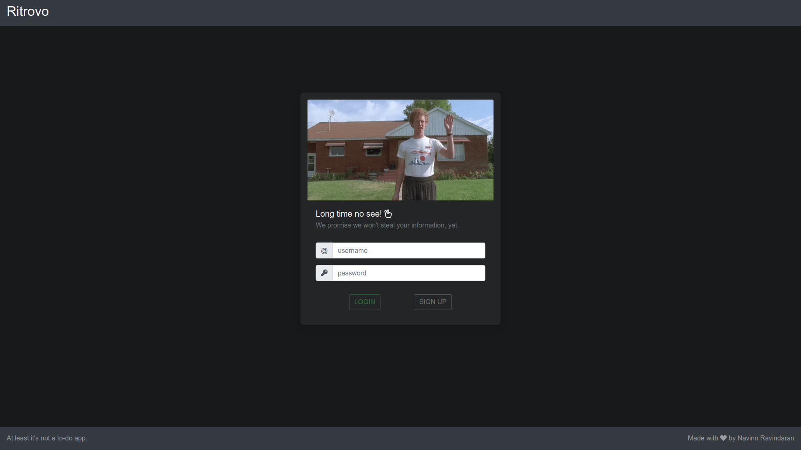
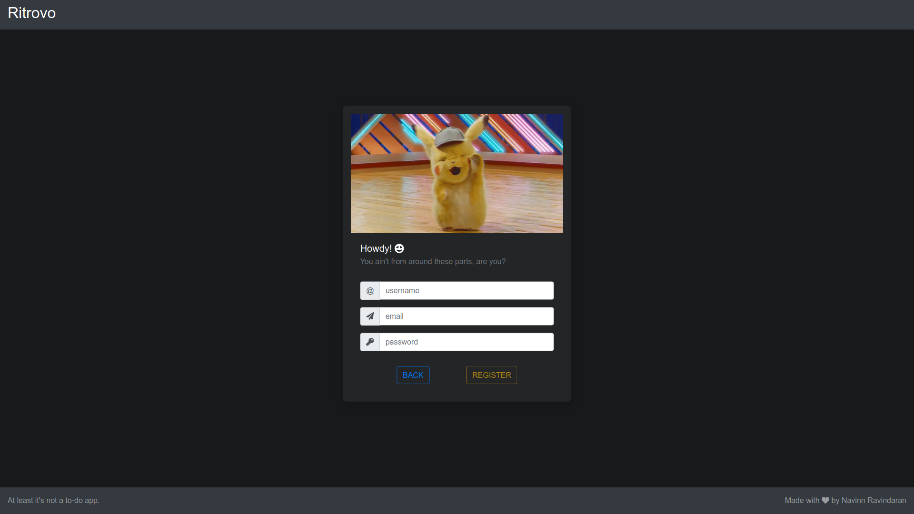
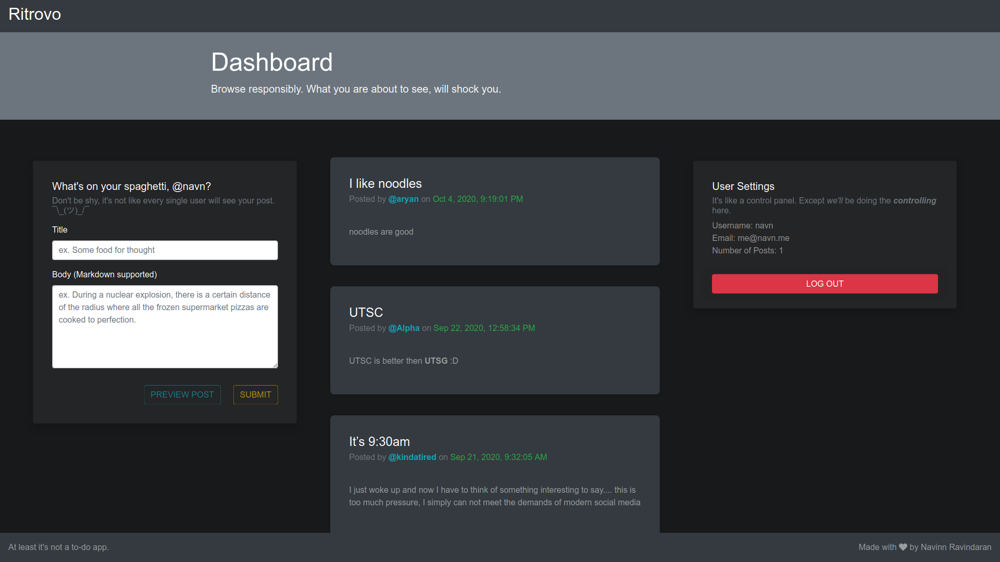
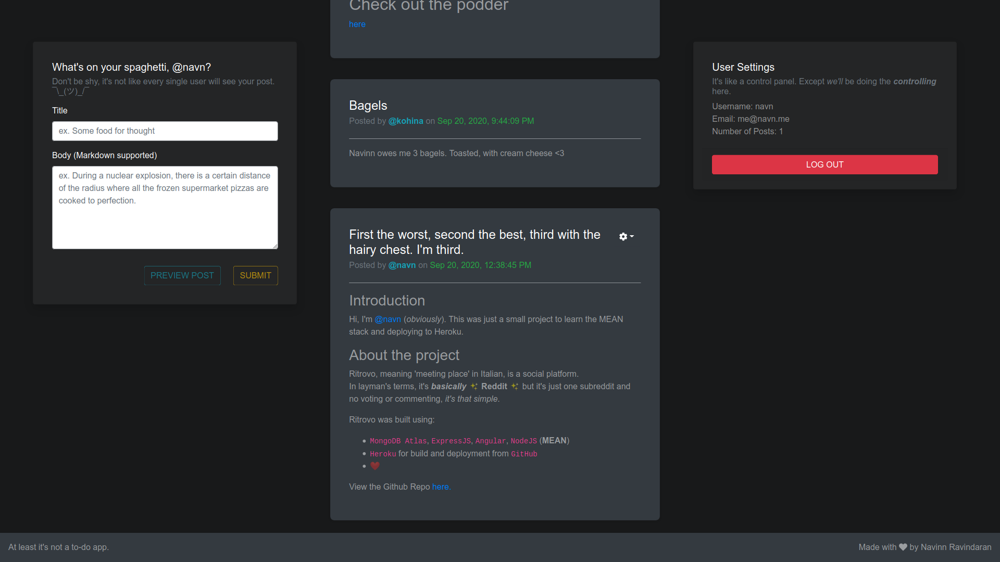

# Ritrovo
> At least it's not a to-do app.    

Ritrovo, meaning 'meeting place' in Italian, is a social platform. 

In layman's terms, it's **_basically_** :sparkles: **Reddit** :sparkles: but it's just one subreddit and no voting or commenting, *it's that simple*.   

Users can view all posts and create/edit/delete posts of their own, written in **Markdown**, *because plain text is boring*.

## Built using...

- Angular 10
- ng-bootstrap
- Node.js
- Express.js
- MongoDB Atlas
- ♥

## Screenshots 📸
 

<h5 align="center">
  
</h5>
<h5 align="center"> 

 *Login Screen (1920x1080)*  

</h5>
 

<h5 align="center">
  
</h5>
<h5 align="center"> 

 *Signup Screen (1920x1080)*  

</h5>
 

<h5 align="center">
  
</h5>
<h5 align="center"> 

 *Dashboard Screen - Top (1920x1080)*  

</h5>
 

<h5 align="center">
  
</h5>
<h5 align="center"> 

 *Dashboard Screen - Bottom (1920x1080)*  

</h5>
 

-------------------------------------------------------------------------------------------

This project was generated with [Angular CLI](https://github.com/angular/angular-cli) version 10.0.7.

## Development server

Run `ng serve` for a dev server. Navigate to `http://localhost:4200/`. The app will automatically reload if you change any of the source files.

## Code scaffolding

Run `ng generate component component-name` to generate a new component. You can also use `ng generate directive|pipe|service|class|guard|interface|enum|module`.

## Build

Run `ng build` to build the project. The build artifacts will be stored in the `dist/` directory. Use the `--prod` flag for a production build.